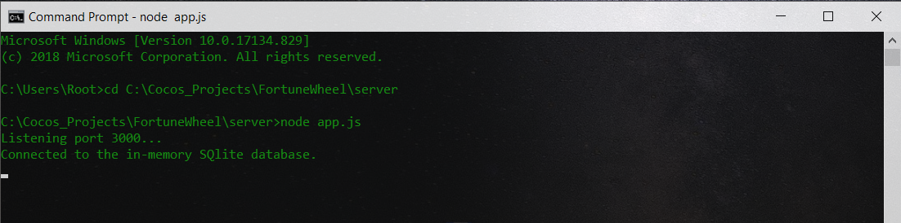
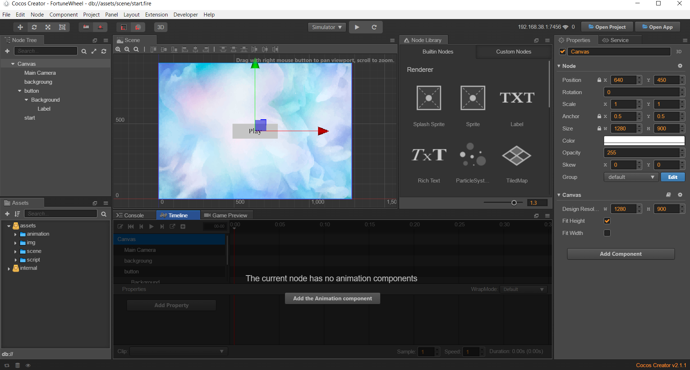
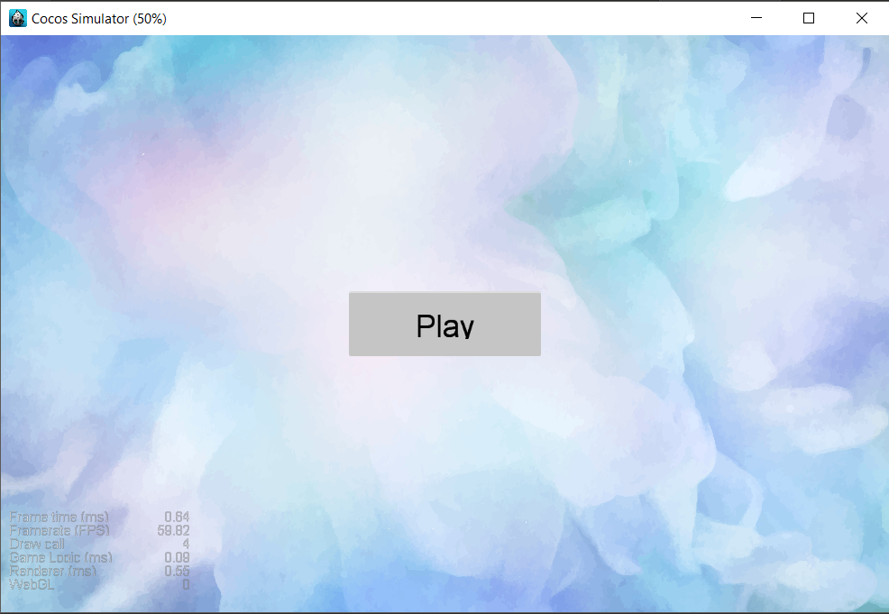
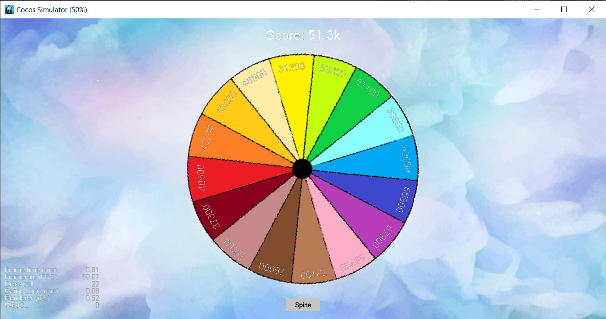

Fortune Wheel [Cocos2d-js + Node.js]
===

This is the simple good looking game. Using Cocos2d library for UI and Node.js as a backend.
For storing data at the server using Sqlite3 temporary (in memory) DB.

1. **Run server**
(First of all you must run a server)

2. **Run app in Cocos Creator**
(Just open the project in Cocos Creator and run it)

3. **Start screen**

4. **Play screen**

